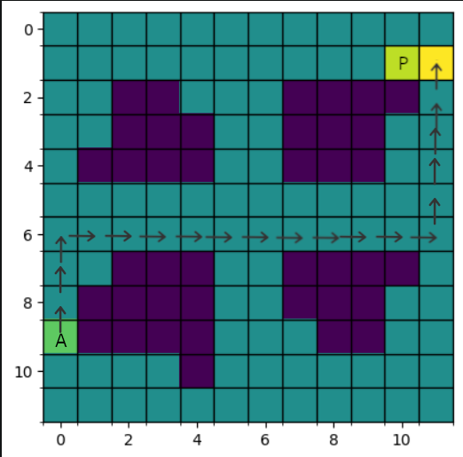

# Jumbo Mana technical test

This readme file details the step I took to attempt to solve the jumbo mana technical test

I tried to mention all the steps I took in detail in order to demonstrate my thinking process and the way in which I apporach learning about new concepts, if you do not wish to read about the learning phase you can skip to step 2.

## Step 0 : setup
Versions:

* Python 3.11.3
* Cuda 11.8

To run this program, execute the following commands in a **miniconda** terminal:
 
``` 
conda env create -f conda_env.yml
conda activate conda_env
python main.py
```
in main.py, change the parameters for print(get_shortest_path(matrix,11, 8)) to change the AI's starting position


## Step 1 : learning
The test requires the use and manipulation of reinforcement learning techniques, in particular Q-learning techniques, which I am not yet familiar with. So I started by watching a YouTube tutorials to get started.

Here are some notes I have taken:

**video links**: 
* https://www.youtube.com/watch?v=wVXXLLT6srY
* https://www.youtube.com/watch?v=__t2XRxXGxI

### What is reinforcement learning: 
RL is a ML paradigm in which the goal is to train a machine to understand its environment so it can take actions that will maximize cumulative rewards. This is typically done through trial and error.

RL is based on five principles: An input and output system, rewards, an environment, Markov decision processes and training & inference.

### Input and output system:
In RL :
* inputs are states and rewards, and outputs are actions
* The goal of the model is to identify an optimal **policy** that tells us which action to take in any given state

### Rewards
A reward is a metric that tells the system how well it is performing

**General goal**: Maximize total rewards over time

### Environment

* The environment is the setting in wich the RL system is operation
* It defines the "rules of the game" :
  * The set of possible actions
  * State transitions
  * the rewards assiociated with each action.

### Markov Decision process
a framework for modeling decision making when outcomes are partly random and partly under the control of a decision maker.

### What is Q-learning:
* A type of RL
* involves model-free environment, the agent attempts to construct an optimal **policy** directly by interacting with the environment
* trial and error based approach.

### What are Q-Values:
* A Q-value indicates the **quality** of a particular action **a** in a given state **s**: **Q(s, a)**
* Q-values are the current estimates of the sum of future rewards after an action from the current state.

### Q-tables: 
* Q-values are stored in a **Q-table**, which has one row for each possible state, and one column for each possible action
* An optimal Q-table contains the values that allow the AI agent to take the best action in any possible state, thus providing the agent with the optimal path to the highest reward
* The Q-table represents the AI agent **policy** for acting in the current environment.

### Temporal difference

* A method of calculating how much the Q-value for the action taken in the previous state shoud be changed based on what the AI agent has learned about the Q-values for the current state's action


### The Bellman equation
* This equation tells us what new value to use as the Q-value for the ation taken in the previous state


## Step 1.5 :
My first attempt in solving this problem was unsuccessful. I tried using openAI gym Environments and pre existing stable baselines3 models. 
This approach did not give me good results, so I decided to take a few steps back and take a more low-level approach

However, I still left this attempt in this repository if you wish to take a look.

## Step 2: Creating the environment

For this step I am creating the custom matrix environment in which my agent will operate.

For this I created the Matrix class.

The environment for this problem is a 12x12 matrix with 4 main obstacles

* Each state (square) is assigned a reward value : -100 for obstacles, -1 for normal squares, and 100 for the goal state 
* Using negative rewards will encourage the AI to identify the shortest path to the goal by minimizing its punishments
* moving into an obstacle is a terminal state, and will result in the end of the game. The square on which the player is located is also a terminal state.
* The **Q-values** are store in a 3D numpy array, it contains the Q-values for each state and action pair.

* The AI agent may take 4 possible actions within the environment: up(0), right(1), down(2), left(3) 


## Step 3 : defining some helper function
Next, I defined some helper function to make things more organized.

* **is_terminal_state()**: returns true if the agent has reached a terminal state
* **get_starting_location()**: returns a random row, index pair in which the agent will start, the agent cannot start inside an obstacle.
*  **get_next_action()**: if a randomly chosen value between 0 and 1 is less than **epsilon**, then choose the most promising value from the Q-table for this state. else choose a random action. This mean the agent will choose the best action most of the time but will **sometimes** choose a random action to better explore the environment.
*  **get_next_location()**: returns the new row, index pair after an action has been taken.
*  **get_shortest_path()**: returns the shortest path that the agent finds to the target, use to test after training.

## Step4 : training 
The model was trained for 1000 episodes by letting the agent take actions and then updating the **Q-table** by calculating the temporal differences after each step. 

Once the **Q-table** contains the optimal Q-values, the agent has "learned" to navigate through the environment.

## Result
By testing the model starting at the position (11,8), I got the following result




## Limitations
Although this solution works fairly well on the training environment, it would not generalize very well on new unseen environments due to its reliance on the Q-table that is learned while training.
